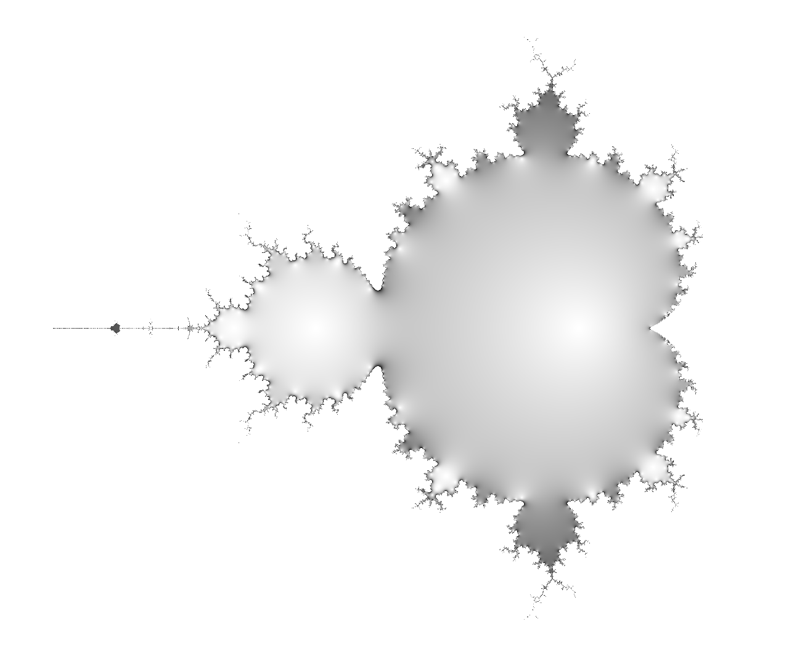

# Mandelbrot

Visualize the [Mandelbrot set](https://en.wikipedia.org/wiki/Mandelbrot_set) on a Gaussian plane.



## Prerequisites

Install [poetry](https://poetry.eustace.io/):

```shell
$ curl -sSL https://raw.githubusercontent.com/sdispater/poetry/master/get-poetry.py | python
```

## Installation

Install the module after download:

```shell
$ poetry install
```

## Usage

Generate an image file:

```shell
$ poetry run mandelbrot image.png
```
